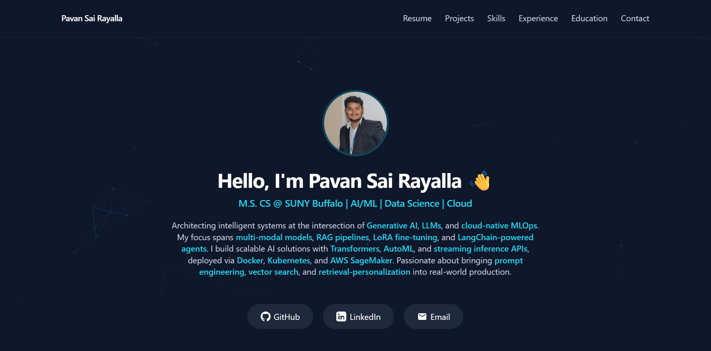

# MY-PORTFOLIO

*Showcase Your Brilliance with Stunning Impact*

---

## 🚀 Live Demo

🔗 [Visit Portfolio](https://pavanrayalla.github.io)

---

## 🛠️ Tech Stack

---

## ✨ Features

- 📬 Contact form with **Node.js** backend deployed on Render
- 📱 Fully responsive design
- 🧠 Sections on Projects, Skills, Experience, and Education
- 📎 GitHub and LinkedIn buttons
- 🖼️ Profile with floating avatar

---

## 📁 Project Structure

my-portfolio/
├── index.html
├── style.css
├── app.js
├── images/
├── README.md

---

## 📫 Contact

- 📧 Email: [rayallapavansai@gmail.com](mailto:rayallapavansai@gmail.com)
- 🌐 GitHub: [github.com/PavanSai-Rayalla](https://github.com/PavanSai-Rayalla)
- 🔗 LinkedIn: [linkedin.com/in/pavan-sai-rayalla](https://linkedin.com/in/pavan-sai-rayalla)

---

> Built with ❤️ by Pavan Sai Rayalla
